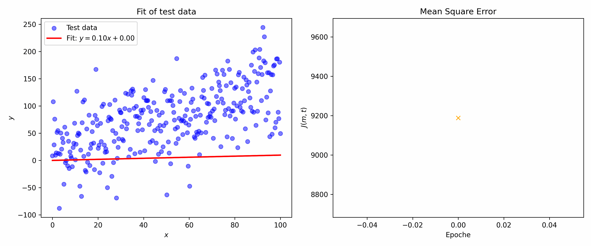

# Model Evaluation and Loss Function

The primary goal of this project is to gain a understanding of linear regression logic by implementing it from scratch.

### The Loss Function: Mean Squared Error (MSE)

To measure how well the model performs, I use the Mean Squared Error method. The loss function, denoted as $J(m, t)$, calculates the average of the squared differences between the actual values and the predicted values.

$$J(m, t) = \frac{1}{n} \sum_{i=1}^{n} (y_i - (m \cdot x_i + t))^2$$

where ...
* $y_i$ and $x_i$: are the actual data points
* $m$: is the steepness of the regression line (weight / slope).
* $t$: is the y-axis intercept
* $\alpha$: is the learning rate. A parameter that determines the step size during optimization.

The process of squaring the differences serves two main purposes:
1.  **Eliminating Negatives**: It ensures that positive and negative errors do not cancel each other out.
2.  **Penalizing Outliers**: Larger errors result in a significantly higher penalty, forcing the model to prioritize reducing big gaps between predicted and actual values.

The objective of the training process is to "tweak" $m$ and $t$ to find the minimum possible value for $J(m, t)$, resulting in the most accurate prediction line possible given the data.

  

